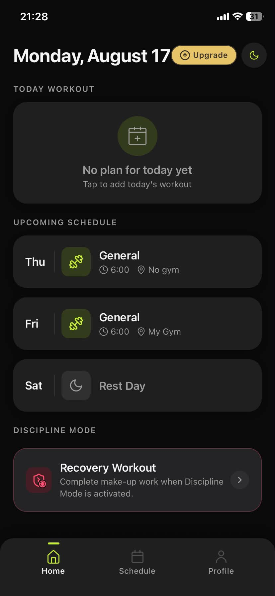
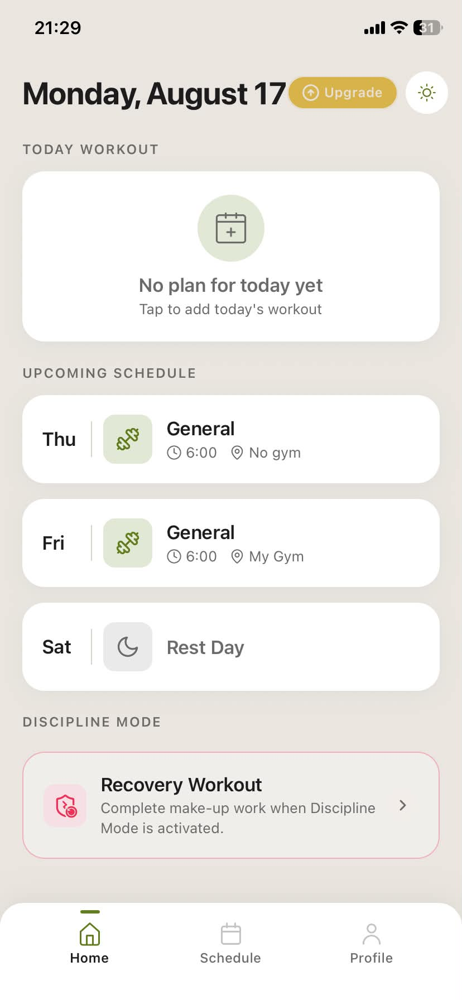
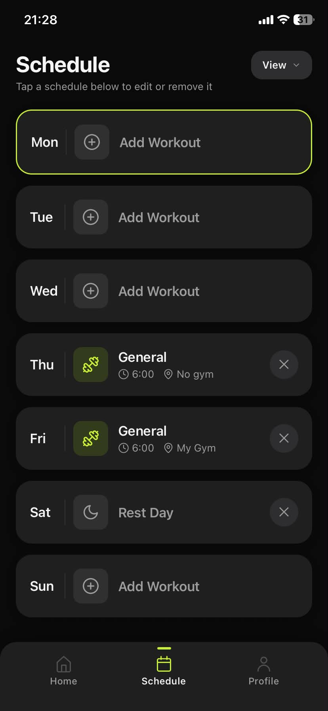
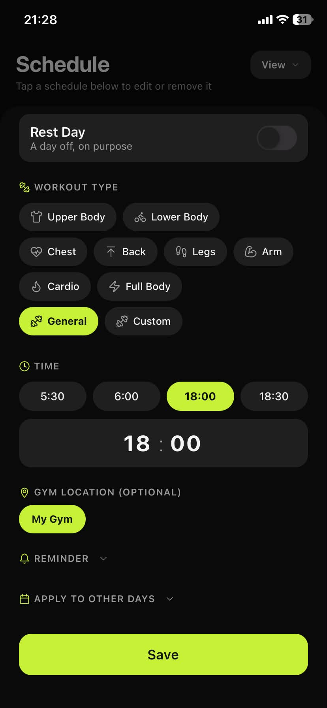
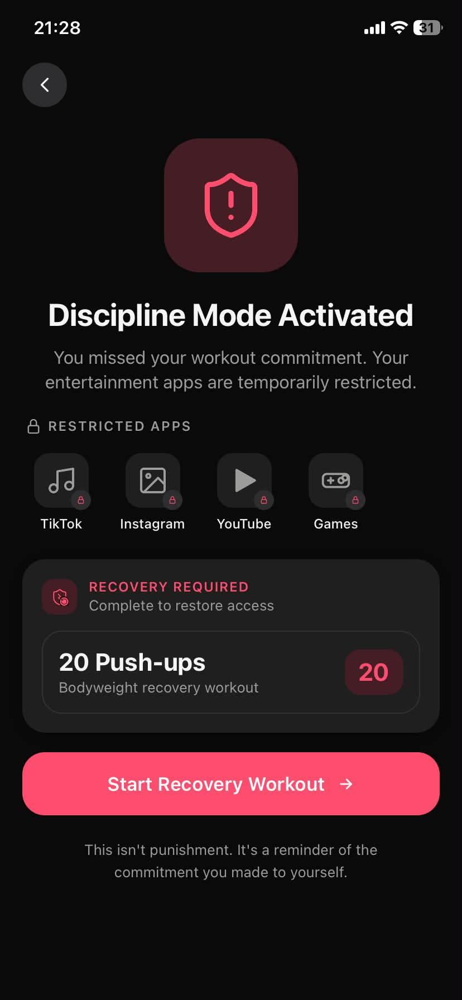
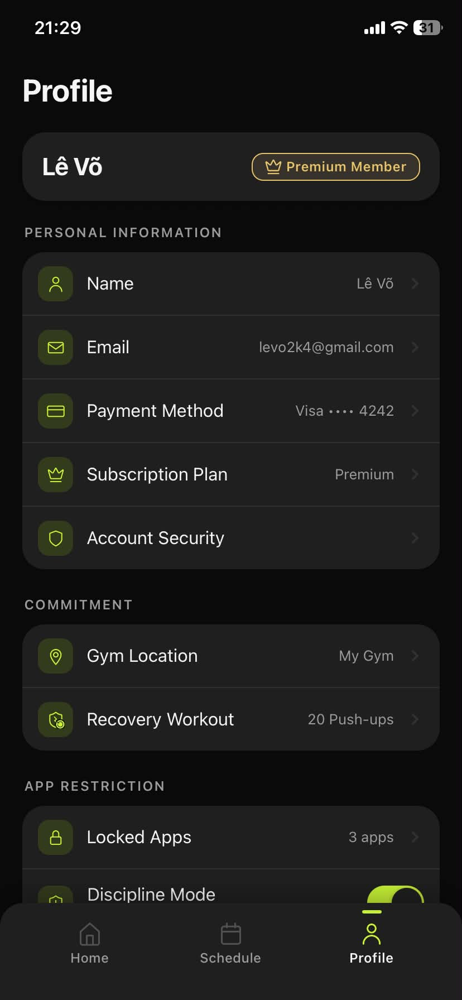

# Forge

Ứng dụng di động hỗ trợ duy trì kỷ luật tập luyện: đặt lịch tập, xác minh khi đến phòng gym, và chế độ "Discipline Mode" khóa các app gây xao nhãng nếu bỏ lỡ buổi tập.

## Nhóm 23

| Họ tên           | MSSV       | Vai trò        |
| ---------------- | ---------- | -------------- |
| Lê Võ            | N22DCCN097 | Nhóm trưởng    |
| Trần Nhật Nguyên | N22DCCN057 | Thành viên     |

## Ảnh chụp màn hình

|                                                                                                                    |                                                                                                           |
| ------------------------------------------------------------------------------------------------------------------ | --------------------------------------------------------------------------------------------------------- |
| <br>Trang chủ — bài tập hôm nay và lịch sắp tới            | <br>Trang chủ ở giao diện sáng                   |
| <br>Lịch tập theo tuần, chạm để chỉnh sửa/xóa          | <br>Đặt loại bài tập, giờ tập và phòng gym    |
| <br>Chế độ kỷ luật: khóa app khi bỏ lỡ buổi tập      | <br>Hồ sơ cá nhân và cài đặt                        |

## Công nghệ sử dụng

- [Expo](https://expo.dev) + [Expo Router](https://docs.expo.dev/router/introduction/) (React Native, TypeScript)
- [NativeWind](https://www.nativewind.dev/) (TailwindCSS cho React Native)
- [Supabase](https://supabase.com) (Auth + Database)

## Cấu trúc thư mục

```
app/            Định tuyến màn hình (Expo Router)
screens/        Giao diện từng màn hình
components/     Component dùng chung (card, sheet, icon, picker...)
lib/            Gọi Supabase và xử lý dữ liệu (auth, schedule, gym...)
contexts/       React Context (Auth, Theme)
constants/      Màu sắc, kích thước, typography dùng chung
locales/        Đa ngôn ngữ (vi/en)
```

## Cài đặt

```bash
npm install
```

Tạo file `.env` từ `.env.example` và điền thông tin Supabase:

```bash
cp .env.example .env
```

```
EXPO_PUBLIC_SUPABASE_URL=
EXPO_PUBLIC_SUPABASE_ANON_KEY=
EXPO_PUBLIC_GOOGLE_WEB_CLIENT_ID=
```

## Chạy dự án

```bash
npx expo start
```

Sau đó quét mã QR bằng ứng dụng **Expo Go** (iOS/Android), hoặc nhấn:

- `i` để chạy trên iOS Simulator
- `a` để chạy trên Android Emulator
- `w` để chạy trên trình duyệt (web)
